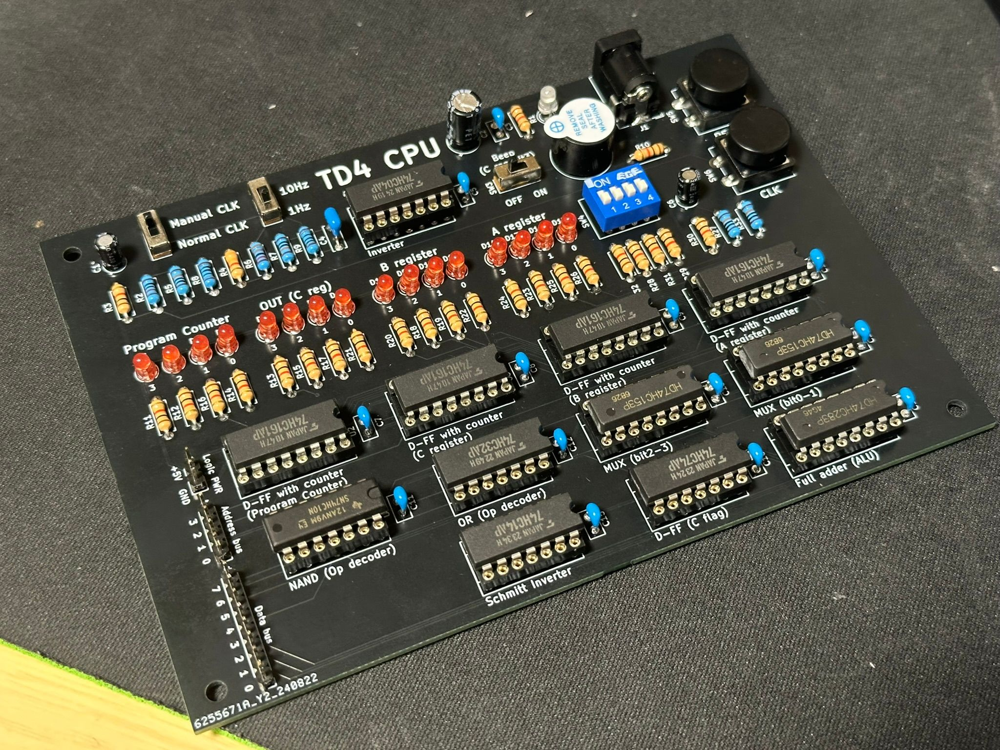

# TD4 CPU
書籍「CPUの創りかた」にあるTD4 CPUの回路を、ユニバーサル基板で作るのがめんどくさかったので基板にしたものです。
製作の際は書籍を購入することをお勧めします。

*完成させた基板のサンプル*

## フォルダ解説
### `schematic`
回路図と基板のKiCadデータが入っています。バージョンは8.0です。
なんかのフットプリントをライブラリで入れてた気がしますがなくても読めるっぽいです。

### `schematic_pdf`
回路図のpdfファイルが入っています。

### `rom_emulator`
ArduinoなどのマイコンでROMを作るためのプログラムが入っています。  
Arduino UNO系と、Raspberry Pi Pico(MicroPython)があります。

#### Arduino UNO系
Arduino UNO R4 WiFiで動作確認しています。  
ポートレジスタの操作ではなく`digitalWrite`を使っているのでMinimaやR3でも動くと思います。

以下のように接続してください。

| Arduino側 | TD4 CPU側     |
| --------- | ------------- |
| VIN       | +5V           |
| GND       | GND           |
| D11       | Address bus 3 |
| D10       | Address bus 2 |
| D9        | Address bus 1 |
| D8        | Address bus 0 |
| D7        | Data bus 7    |
| D6        | Data bus 6    |
| D5        | Data bus 5    |
| D4        | Data bus 4    |
| D3        | Data bus 3    |
| D2        | Data bus 2    |
| D1        | Data bus 1    |
| D0        | Data bus 0    |

#### Raspberry Pi Pico
Raspberry Pi Pico無印で動作確認済みです。
ファイル名を`main.py`に変更して送信すれば動作すると思います。

以下のように接続してください。

| Raspberry Pi Pico側 | TD4 CPU側     |
| ------------------- | ------------- |
| 39 VSYS             | +5V           |
| 38 GND              | GND           |
| 4  GP2              | Address bus 3 |
| 5  GP3              | Address bus 2 |
| 6  GP4              | Address bus 1 |
| 7  GP5              | Address bus 0 |
| 9  GP6              | Data bus 7    |
| 10 GP7              | Data bus 6    |
| 11 GP8              | Data bus 5    |
| 12 GP9              | Data bus 4    |
| 13 GP10             | Data bus 3    |
| 14 GP11             | Data bus 2    |
| 15 GP12             | Data bus 1    |
| 16 GP13             | Data bus 0    |
